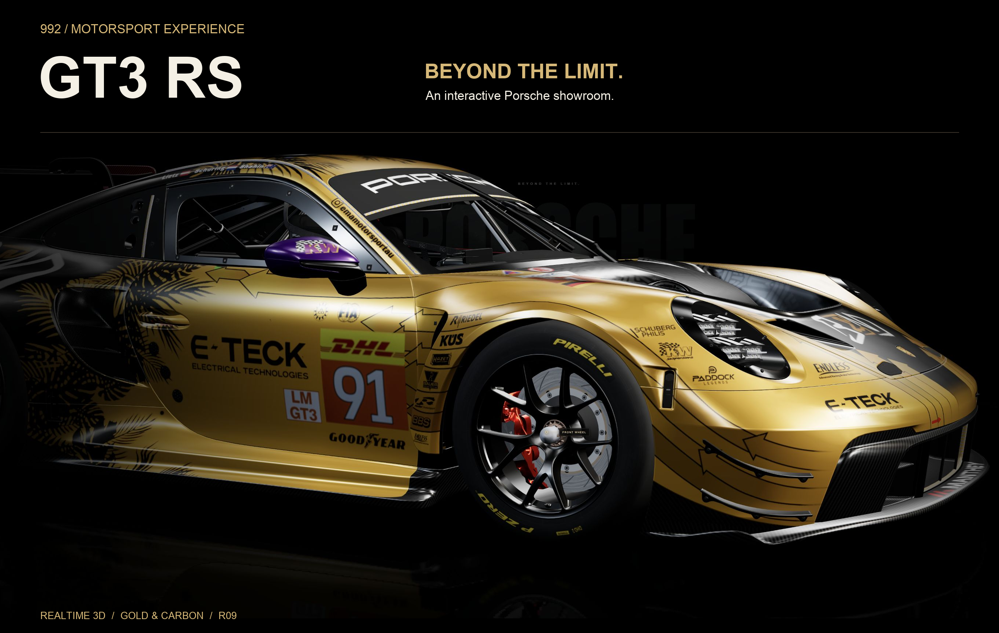
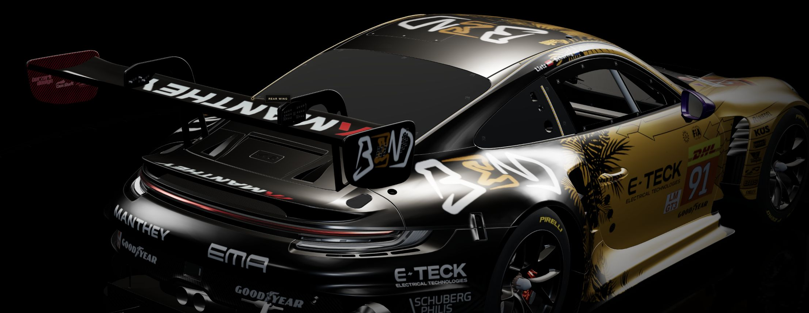
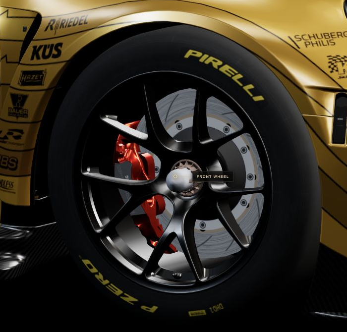
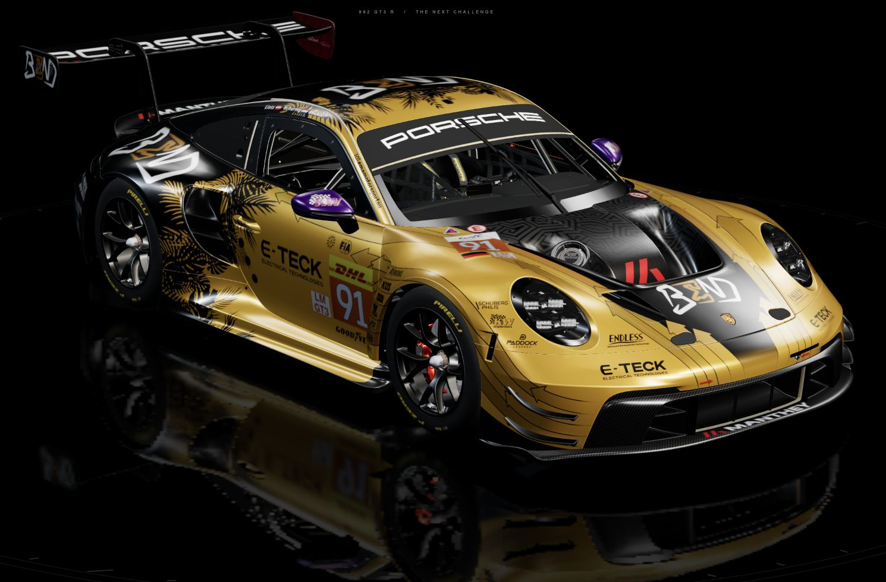

<p align="center">
  <a href="https://lee-study154.github.io/porsche-gt3-showroom/">
    
  </a>
</p>

<h1 align="center">Porsche GT3 RS Showroom</h1>
<p align="center">Explore the details. Hold to race. Release to return.</p>
<p align="center">
  <a href="https://lee-study154.github.io/porsche-gt3-showroom/"><strong>ENTER THE SHOWROOM ↗</strong></a>
  &nbsp; · &nbsp;
  <a href="#behind-the-images">View original 4K captures</a>
  &nbsp; · &nbsp;
  <a href="#take-control">Controls</a>
</p>

**GT3 RS Showroom** is an interactive Porsche experience built with Three.js. Gold-and-black livery, a reflective studio floor, close-up camera presets and a hold-to-race sequence — all rendered in your browser.

## Up close

### 01 / Shaped by air

<a href="assets/readme/aero-4k.jpg"></a>

The rear-wing preset moves around the car into an aero detail view. The paint, glass, rubber and carbon surfaces respond to the showroom lighting in real time.

### 02 / Contact & reflection

<table>
  <tr>
    <td width="40%" align="center"><a href="assets/readme/tyres-4k.jpg"></a></td>
    <td width="60%" align="center"><a href="assets/readme/showroom-4k.jpg"></a></td>
  </tr>
  <tr><td align="center"><strong>THE CONTACT PATCH</strong></td><td align="center"><strong>THE STUDIO FLOOR</strong></td></tr>
</table>

## Take control

| Action | Experience |
| :--- | :--- |
| Drag / touch-drag | Rotate the car; keep your chosen view when you release. |
| Scroll / pinch | Move closer or pull back. |
| Hold **HOLD TO RACE** | Enter the tunnel, change camera posture and bring telemetry into focus. |
| Release | Coast down and transition back to the showroom. |
| **CAR · AERO · POWER · TYRES · TECH** | Move smoothly between the overview and part-focused views. |
| **AUTO ORBIT · SOUND · RESET VIEW** | Start a camera tour, toggle synthesized audio or restore the overview. |

On desktop, you can also hold **Space** while the scene is focused. Speed, gear and throttle are simulated visual telemetry.

## Behind the images

These are **real captures of the R09 website**, reframed for this README. No generated car imagery, AI upscaling or texture repainting. The photographic layers use native-pixel crops; PNG compositions preserve those captured pixels. The original browser captures are **3840 × 2160 JPEGs**.

**Originals:** [Full car](assets/readme/showroom-4k.jpg) · [Rear wing](assets/readme/aero-4k.jpg) · [Front wheel](assets/readme/tyres-4k.jpg)

The showroom uses the original downloaded GLB with its **4096 × 4096 body base-color texture**; other textures have their own resolutions. The three delivery chunks reconstruct the same **39,967,176-byte** model. README artwork does not change the model, rendering settings or runtime.

<details>
<summary><strong>Run locally & hosting notes</strong></summary>

This repository contains the static, bundled delivery. No application backend or build step is required.

```sh
git clone https://github.com/Lee-study154/porsche-gt3-showroom.git
cd porsche-gt3-showroom
python3 -m http.server 8080 --bind 127.0.0.1
```

Open **http://127.0.0.1:8080/**. Keep `index-cdn.html` and all three `porsche-gt3-r.glb.part*` files together. The root `index.html` redirects to the showroom.

A WebGL-capable browser is required. The initial model transfer is approximately 40 MB, so loading time depends on the connection. GitHub Pages availability varies by region and network; splitting the model does not remove that limitation. Actual frame rate depends on the device and browser.

</details>

## Model identity & credit

**GT3 RS** is the project display name. The current R09 website and these screenshots use a **2024 Porsche 992 GT3 R** asset. GT3 R and GT3 RS are different models; this presentation does not represent an RS model conversion.

[2024 Porsche 992 GT3 R](https://sketchfab.com/3d-models/2024-porsche-992-gt3-r-b76c9b2ae2d548c3869426eac4ab8a19) by **[Dave Love SketchFab (@Tyler_Dave)](https://sketchfab.com/Tyler_Dave)**, listed under **[CC BY 4.0](https://creativecommons.org/licenses/by/4.0/)**.

The showroom adjusts material response, lighting, camera choreography and wheel motion at runtime. The screenshots show that adapted presentation. This model attribution does not assign the same license to every file in this repository. Independent showcase project; not an official Porsche website.

---

<p align="center"><strong>THE TRACK IS YOURS.</strong><br><a href="https://lee-study154.github.io/porsche-gt3-showroom/">Open the interactive experience ↗</a></p>
